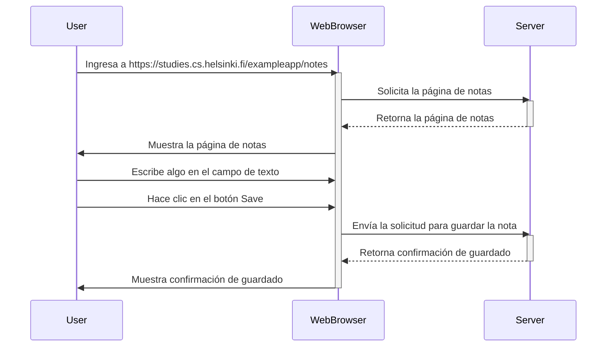
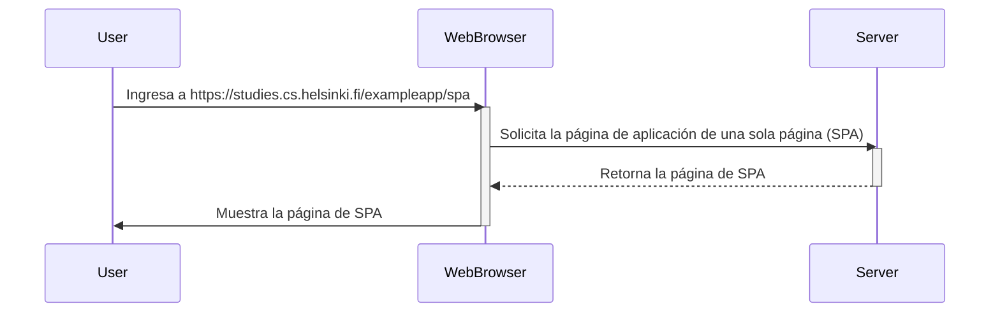

# Ejercicios Full Stack Open
Exercises from Full Stack Open

### 0.4: Nuevo diagrama de nota

Crea un diagrama similar que describa la situación en la que el usuario crea una nueva nota en la página https://studies.cs.helsinki.fi/exampleapp/notes escribiendo algo en el campo de texto y haciendo clic en el botón Save.

```
sequenceDiagram
    participant User
    participant WebBrowser
    participant Server
    User->>WebBrowser: Ingresa a https://studies.cs.helsinki.fi/exampleapp/notes
    activate WebBrowser
    WebBrowser->>Server: Solicita la página de notas
    activate Server
    Server-->>WebBrowser: Retorna la página de notas
    deactivate Server
    WebBrowser->>User: Muestra la página de notas
    User->>WebBrowser: Escribe algo en el campo de texto
    User->>WebBrowser: Hace clic en el botón Save
    WebBrowser->>Server: Envía la solicitud para guardar la nota
    activate Server
    Server-->>WebBrowser: Retorna confirmación de guardado
    deactivate Server
    WebBrowser->>User: Muestra confirmación de guardado
    deactivate WebBrowser

```



### 0.5: Diagrama de aplicación de una sola página

Crea un diagrama que describa la situación en la que el usuario accede a la versión de aplicación de una sola página de la aplicación de notas en https://studies.cs.helsinki.fi/exampleapp/spa.

```
sequenceDiagram
    participant User
    participant WebBrowser
    participant Server
    User->>WebBrowser: Ingresa a https://studies.cs.helsinki.fi/exampleapp/spa
    activate WebBrowser
    WebBrowser->>Server: Solicita la página de aplicación de una sola página (SPA)
    activate Server
    Server-->>WebBrowser: Retorna la página de SPA
    deactivate Server
    WebBrowser->>User: Muestra la página de SPA
    deactivate WebBrowser
```



