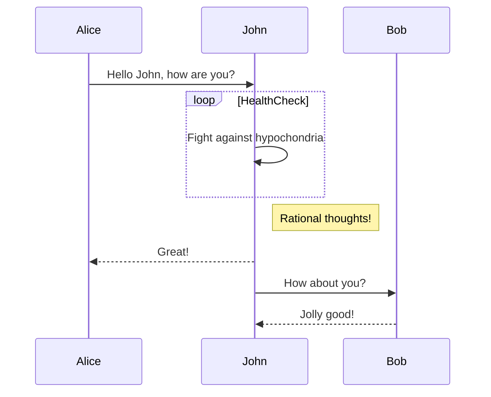

# Ejercicios Full Stack Open
Exercises from Full Stack Open

### 0.4: Nuevo diagrama de nota

Crea un diagrama similar que describa la situación en la que el usuario crea una nueva nota en la página https://studies.cs.helsinki.fi/exampleapp/notes escribiendo algo en el campo de texto y haciendo clic en el botón Save.

```
sequenceDiagram
Alice->>John: Hello John, how are you?
loop HealthCheck
    John->>John: Fight against hypochondria
end
Note right of John: Rational thoughts!
John-->>Alice: Great!
John->>Bob: How about you?
Bob-->>John: Jolly good!
```


